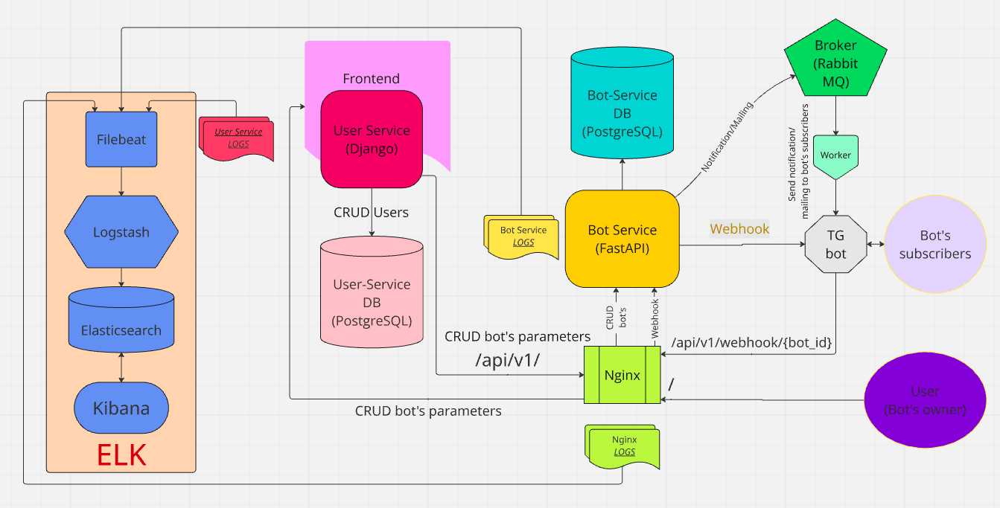

# Nocode-bot
[https://nocode-bot.ru](https://nocode-bot.ru)

Платформа для создания телеграм ботов без знания программирования. Взаимодействие с телеграм построено с помощью Webhook. Платформа предлагает пользователю функционал для работы с аудиторией бота, который может настроить любой человек без знания языков программирования.

# Схема проекта и используемые технологии

* FastAPI
* Django
* PostgreSQL
* SQLAlchemy
* Alembic
* Docker
* Nginx
* Certbot
* Настроен pre-commit и CI проверки кода различными линтерами
* Pytests, unittest
## Переменные окружения
Создайте файл /.env используя /.env.example(.env.dev для локального запуска).
Для настройки Webhook telegram необходимо иметь SSL сертификаты. Для локальной разработки можно использовать Ngrok(инфу по установки можно найти в интернете).
```
ngrok http 8080
```
Пробрасываем локальный порт 8080(на котором развернут bot_service) в сеть. Вписываем Forwarding адрес в переменную в .env - WEBHOOK_URL.

Ngrok должен быть запущен на протяжении работы с платформой.
## Команды Makefile
Для локального запуска проекта:
```
make start-dev
```
Запуск тестов всех сервисов.
```
make run-tests
```

Платформа будет доступна по адресу http://127.0.0.1:8000/.

API-документация: http://127.0.0.1:8080/docs.

Так же имеются команды необходимые для запуска каждого сервиса отдельно.